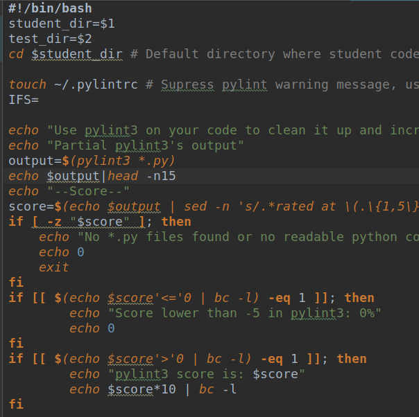
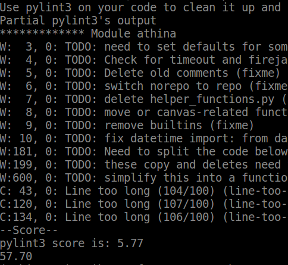
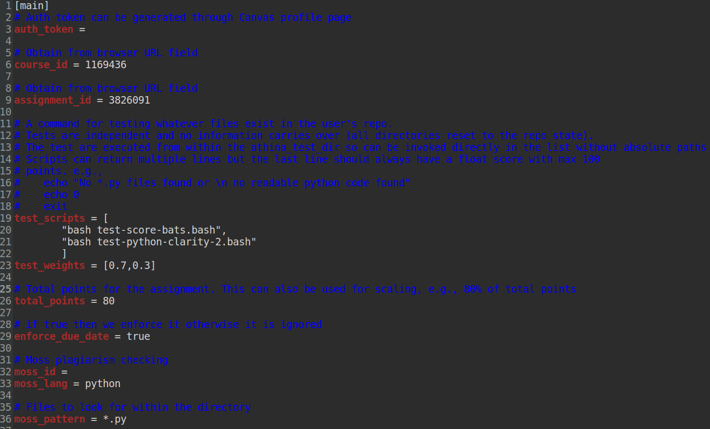
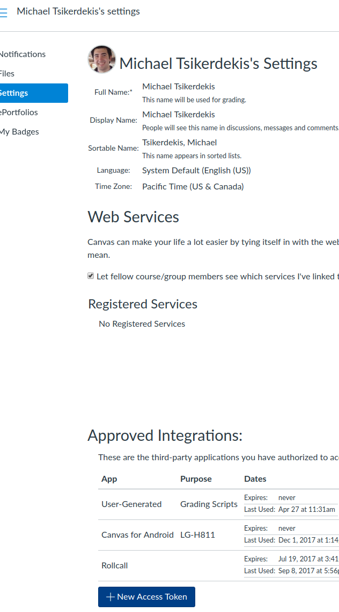

# ATHINA - An autograder, automated feedback microservice

Build status:
[](https://athina.semaphoreci.com/projects/athina)

Code Quality Metrics:
[](https://sonarcloud.io/summary/new_code?id=athina-edu_athina)
[](https://sonarcloud.io/summary/new_code?id=athina-edu_athina)
[](https://sonarcloud.io/summary/new_code?id=athina-edu_athina)
[](https://sonarcloud.io/summary/new_code?id=athina-edu_athina)
[](https://sonarcloud.io/summary/new_code?id=athina-edu_athina)
[](https://sonarcloud.io/summary/new_code?id=athina-edu_athina)
[](https://sonarcloud.io/summary/new_code?id=athina-edu_athina)
[](https://sonarcloud.io/summary/new_code?id=athina-edu_athina)
[](https://sonarcloud.io/summary/new_code?id=athina-edu_athina)
[](https://sonarcloud.io/summary/new_code?id=athina-edu_athina)


Athina is a formative assessment microservice for programming assignments. There is also an optional associated web interface 
for managing multiple assignments by multiple instructors on a single machine (see [Athina-Web](https://github.com/athina-edu/athina-web)).

Need plug-and-play assignments, tests and test configuration for your course? Check out [Athina Assignments](https://github.com/athina-edu/athina-assignments) repository.

| Supported programming languages        | Supported e-learning platforms           | 
| :-------------: |:-------------:| 
|       |  | 
|   **Supported VCS (anything Git)**      | **Supported plagiarism check software**      |
|      | Moss |

# Here is what it does:
1. Build your tests in your language of choice
2. Your tests can print anything. The last line is the grade from 0-100
3. Setup Athina's yaml file and define tests and their weights along with other options (e.g., students per assignment)
4. Place your files in the tests directory and construct your environment (using Dockerfile)
5. Run athina as a service
6. Students submit on Canvas their repo urls.
7. Athina, clones, looks for changes, runs some safety checks, sandboxes the code and then uses your tests.
8. Then, it submits feedback, grade along with all text printed from the test to the student's Canvas
submission page (as a comment or file attachment containing the text).

# Security Features
* All tests are sandboxed (using firejail or docker)
* Only 1 student can submit the same git url, but can also permit more (for group projects)
* Moss implementation notifies student of the average similarity scores for plagiarism
* Git authentication only happens under the specified domain url (e.g., github.com)
* Git credentials and configuration cannot be obtained through student code execution
* Tests are forcefully timed out after a certain period of time (e.g., in case of infinite loops)

# Testing

Athina includes a comprehensive test suite that can run in both local development and production environments.

## Quick Start

```bash
# Install dependencies
pipenv install --dev

# Run all tests (uses SQLite, no database setup needed)
pipenv run pytest

# Or use the convenient test runner script
./run_tests.sh
```

For more details, see [TESTING.md](TESTING.md).

## Test Modes

- **Local Development** (default): Uses SQLite - no database configuration needed
- **Production/CI**: Uses MySQL with automatic Docker container management

```bash
# Run with MySQL in Docker (like production)
ATHINA_USE_DOCKER_MYSQL=1 pipenv run pytest
```

## Requirements

- Python 3.14+ (local development with pipenv)
- Python 3.12+ (CI/CD testing with Semaphore — 3.14 not yet available on Semaphore)
- Docker (for MySQL tests and production)
- pipenv (for dependency management)

# Installation
## One click run/install
This includes Athina's Web Interface and auto configuration:

`git clone https://github.com/athina-edu/athina-one-click-run`

`cd athina-one-click-run`

`./run.sh`

Navigate to 127.0.0.1:8000 (or your domain) on your browser and add some assignments
using your newly created root user or signup with another user. Athina will automatically test
these depending on their configuration file.

## via Docker
`sudo apt install docker.io docker-compose` # *(Ubuntu 18.04 or revise according to your distro)*

`wget https://raw.githubusercontent.com/athina-edu/athina/master/docker-compose.yml`

`docker-compose run athina <command line params>`

## from Source (Ubuntu 18.04)
`sudo apt install python3 python3-pip git firejail docker.io`

`git clone https://github.com/athina-edu/athina.git`

`pip3 install .`


# Video Tutorial
How to configure and build tests: https://youtu.be/TAYRRYnk3NQ

# Usage (10 second tutorial)
The following runs the [example configuration](config-examples) (your tests) against a [test repo](https://github.com/athina-edu/testing.git) (e.g., student code) that contains a simple python file. 
Tests use pylint3 and output a grade for the student.

#### docker

`docker-compose run athina --config config-examples/ --repo_url_testing=https://github.com/athina-edu/testing.git`

#### source build


`bin/athina-cli --config config-examples/ --repo_url_testing=https://github.com/athina-edu/testing.git`

Tests that use docker (instead of firejail) take longer the first time they are executed but subsequent runs are virtually instant.

# Usage
1. Build your tests as you would normally. Print as many things that you want students to see and make sure the last 
item(line) you print is their grade from 0-100. Decimals are accepted. The directories of the student code and tests 
are passed as environmental variables to the [Dockerfile](config-examples/Dockerfile).



2. Setup the [configuration file](config-examples/assignementsample.yaml) for athina with your settings. Canvas' access token
can be retrieved from your canvas' personal settings.



3. Copy your tests inside your new folder's tests directory (e.g., [tests](config-examples/tests)).

4. Run athina via command line (if you are not using the one-click-run variant).
    * Running your config assignment but still receiving the log message on terminal (this will send grades to canvas for assignments that have submitted URLs):
    `athina-cli --config /path/to/config/folder --verbose`
    * Running your config assignment and getting a log file inside config directory:
    `athina-cli --config /path/to/config/folder`
    * If you use athinaweb to manage numerous assignments use:
    `athina-cli --json http://yourathinaweburl/assignments/api`
    * If you want to run it as a service use:
    `athina-cli --json http://yourathinaweburl/assignments/api -s`
