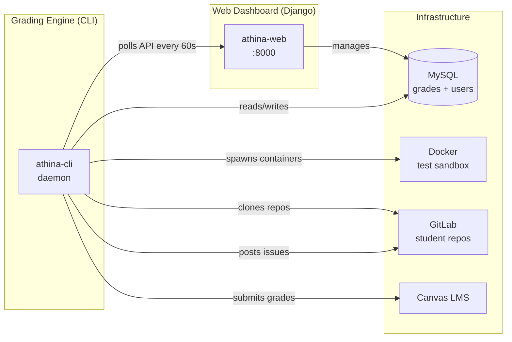

# Athina — Automated Grading Platform

[](https://athina.semaphoreci.com/projects/athina)
[](https://opensource.org/licenses/MIT)

Athina is an automated grading platform for programming assignments. It includes a CLI grading engine and a built-in web dashboard for managing courses, assignments, and students.

Need plug-and-play assignments and tests? Check out [Athina Assignments](https://github.com/athina-edu/athina-assignments).

## Quick Start

### Docker Compose (Recommended)

```bash
git clone https://github.com/athina-edu/athina.git
cd athina
docker compose up
```

- **Web dashboard**: http://localhost:8000
- **Grading engine**: runs automatically, polling the web API

### From Source

```bash
git clone https://github.com/athina-edu/athina.git
cd athina

# CLI only
pip install .

# CLI + Web Dashboard
pip install ".[web]"

# Start the web dashboard
python manage.py migrate
python manage.py runserver 0.0.0.0:8000

# Start the grading daemon (separate terminal)
athina-cli --json http://localhost:8000/assignments/api/ -s -v
```

### One-Click Install (Production)

Uses the [athina-one-click-run](https://github.com/athina-edu/athina-one-click-run) bundle for a full production deployment with nginx, MySQL, and SSL.

```bash
git clone https://github.com/athina-edu/athina-one-click-run.git
cd athina-one-click-run
sudo ./run.sh
```

## Architecture


```mermaid
graph LR
    subgraph "Web Dashboard (Django)"
        W[athina-web<br/>:8000]
    end
    subgraph "Grading Engine (CLI)"
        C[athina-cli<br/>daemon]
    end
    subgraph "Infrastructure"
        DB[(MySQL<br/>grades + users)]
        D[Docker<br/>test sandbox]
        GL[GitLab<br/>student repos]
        CV[Canvas LMS]
    end

    W -->|"manages"| DB
    C -->|"reads/writes"| DB
    C -->|"polls API every 60s"| W
    C -->|"spawns containers"| D
    C -->|"clones repos"| GL
    C -->|"submits grades"| CV
    C -->|"posts issues"| GL
```

### Components

| Component | Description |
|-----------|-------------|
| **`athina-cli`** | Grading daemon — clones repos, runs tests in Docker, computes grades |
| **`athina_web`** | Django web dashboard — manages courses, assignments, students, displays results |
| **MySQL** | Stores grades, student data, LLM feedback, plagiarism scores |
| **Docker** | Sandboxes student code execution with memory/network limits |

## Features

- **Multi-language testing** — C, C++, Bash, Java, Python, Ruby, R, and more
- **Docker sandboxing** — student code runs in isolated containers with configurable limits
- **AI-powered feedback** — LLM integration via any OpenAI-compatible endpoint (GPT-4, Claude, MiMo, etc.)
- **GitLab Issues output** — grades posted as issues in each student's own repository
- **Canvas LMS integration** — submit grades and comments directly to Canvas
- **Plagiarism detection** — built-in copydetect with similarity scoring
- **Web dashboard** — manage courses, enroll students, view reports, force re-runs
- **Group assignments** — shared repositories with configurable member limits
- **GitLab webhook support** — automatic re-grading when students push new commits
- **Student repo provisioning** — auto-create GitLab repos for students

## Configuration

### Assignment Setup

Each assignment needs an `athina.yaml` in its git template repo:

```yaml
input_method: db                    # 'canvas' or 'db'
test_scripts:
  - bash test-correctness.sh
  - bash test-efficiency.sh
test_weights: [0.8, 0.2]
total_points: 100
enforce_due_date: true
test_timeout: 300
llm_enabled: true
```

### Faculty Profile (Web Dashboard)

Set credentials in the web dashboard (Profile page):

- **GitLab/GitHub** — access tokens for cloning student repos
- **LLM API** — OpenAI-compatible endpoint for AI feedback
- **Output mode** — Canvas or GitLab Issues (per assignment)

Credentials are stored in `.env` files in each assignment directory, written automatically by the web app.

### Environment Variables

| Variable | Default | Description |
|----------|---------|-------------|
| `ATHINA_MYSQL_HOST` | `localhost` | Grading database host |
| `ATHINA_MYSQL_PORT` | `3306` | Grading database port |
| `ATHINA_MYSQL_USERNAME` | `athina` | Grading database user |
| `ATHINA_MYSQL_PASSWORD` | — | Grading database password |

## CLI Reference

### Flags

| Flag | Description |
|------|-------------|
| `-c, --config` | Path to YAML config file or directory |
| `-j, --json` | URL to web API for assignment list |
| `-r, --repo_url_testing` | Test a single repo URL |
| `-v, --verbose` | Verbose console output |
| `-s, --service` | Daemon mode (polls every 60s) |

### Service Mode

```bash
athina-cli --json http://localhost:8000/assignments/api/ -s -v
```

The daemon polls the web API every 60 seconds, pulls the latest assignment config from git, detects new student commits, and runs tests.

### Single-Pass Mode

```bash
athina-cli --config /path/to/config/ --verbose
```

## Web Dashboard

The web dashboard (`athina_web`) provides:

- **Course management** — create courses, enroll students via email or bulk import
- **Assignment management** — create from Git template repos, configure grading options
- **Student view** — grades, test reports, plagiarism reports per student
- **AI Guidance** — view LLM-generated feedback for each student
- **Force Rerun** — trigger re-grading for individual students
- **File browser** — browse and edit assignment files
- **Faculty profiles** — manage Git/LLM credentials per instructor
- **Role-based access** — Admin, Faculty, and Teaching Assistant roles

### Running Locally

```bash
pip install ".[web]"
python manage.py migrate
python manage.py createsuperuser
python manage.py runserver 0.0.0.0:8000
```

## Development

### Prerequisites

- Python 3.11+
- Docker (for test sandboxing)
- MySQL (for production) or SQLite (for development)

### Running Tests

```bash
# Quick run (excludes slow tests)
pytest -m "not slow"

# Full suite
pytest

# With coverage
pytest --cov=athina --cov-report=html
```

### Project Structure

```
athina/
├── athina/                  # Core grading engine (Python package)
│   ├── cli.py               # CLI entry point
│   ├── configuration.py     # YAML config + .env loader
│   ├── tester/              # Test orchestration, Docker sandboxing
│   ├── git/                 # Git repo management (Chain of Responsibility)
│   ├── users.py             # Peewee ORM models (MySQL/SQLite)
│   ├── canvas.py            # Canvas LMS API
│   ├── gitlab_issues.py     # GitLab issue integration
│   ├── llm.py               # LLM feedback generation
│   ├── plagiarism.py        # Plagiarism detection
│   └── moss.py              # MOSS integration (deprecated)
├── athina_web/              # Django web dashboard
│   ├── accounts/            # User management
│   ├── assignments/         # Course/assignment management
│   ├── filemanager/         # In-browser file browser
│   ├── templates/           # HTML templates
│   └── static/              # CSS, JS
├── tests/                   # Test suite
├── config-examples/         # Example configs and test scripts
├── Dockerfile               # CLI image
├── Dockerfile.web           # Web dashboard image
├── docker-compose.yml       # Development compose
├── setup.py                 # Package definition
└── manage.py                # Django management
```

## Security

- **Sandboxed execution** — all student code runs in Docker or firejail containers
- **Network isolation** — containers have configurable network access
- **Memory limits** — prevents resource exhaustion
- **Test timeouts** — kills infinite loops after configurable period
- **Credential isolation** — Git/LLM tokens stored in `.env` files, never in student-accessible paths
- **Git domain restriction** — authentication only under configured domain

## License

MIT — see [LICENCE](LICENCE) for details.

## Video Tutorial

[How to configure and build tests](https://youtu.be/TAYRRYnk3NQ)
