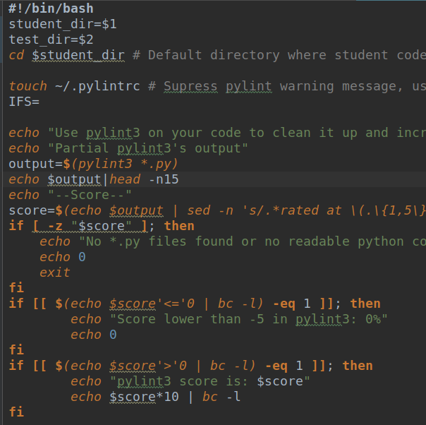
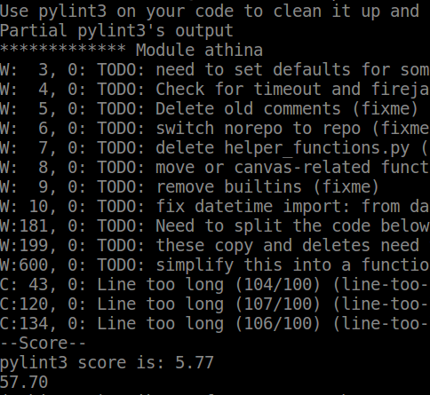
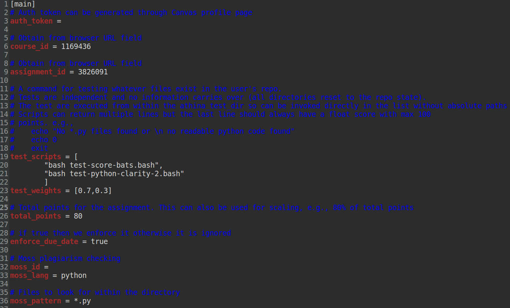
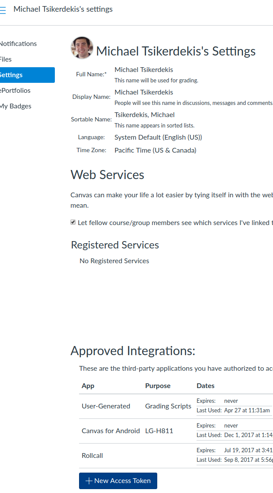

# ATHINA - An autograder, automated feedback microservice

Build status:
[](https://athina.semaphoreci.com/projects/athina)

Code Quality Metrics:
[](https://sonarcloud.io/summary/new_code?id=athina-edu_athina)
[](https://sonarcloud.io/summary/new_code?id=athina-edu_athina)
[](https://sonarcloud.io/summary/new_code?id=athina-edu_athina)
[](https://sonarcloud.io/summary/new_code?id=athina-edu_athina)
[](https://sonarcloud.io/summary/new_code?id=athina-edu_athina)
[](https://sonarcloud.io/summary/new_code?id=athina-edu_athina)
[](https://sonarcloud.io/summary/new_code?id=athina-edu_athina)
[](https://sonarcloud.io/summary/new_code?id=athina-edu_athina)
[](https://sonarcloud.io/summary/new_code?id=athina-edu_athina)


Athina is a formative assessment microservice for programming assignments. There is also an optional associated web interface 
for managing multiple assignments by multiple instructors on a single machine (see [Athina-Web](https://github.com/athina-edu/athina-web)).

Need plug-and-play assignments, tests and test configuration for your course? Check out [Athina Assignments](https://github.com/athina-edu/athina-assignments) repository.

| Supported programming languages        | Supported e-learning platforms           | 
| :-------------: |:-------------:| 
|       |  | 
|   **Supported VCS (anything Git)**      | **Supported plagiarism check software**      |
|      | Moss |

# Features

1. **Grade output modes**: Submit grades to Canvas LMS **or** create GitLab issues in each student's repository
2. **AI-powered feedback**: Generate personalized LLM feedback on student code using any OpenAI-compatible endpoint (GPT-4, Claude, MiMo, etc.)
3. **Multi-language testing**: Build tests in any language — C, C++, Bash, Java, Python, Ruby, R, etc.
4. **Sandboxed execution**: All student code runs in Docker or firejail containers with memory and network limits
5. **Plagiarism detection**: Built-in copydetect and MOSS integration with similarity scoring
6. **Group assignments**: Support for shared repositories with configurable member limits
7. **Environment-based credentials**: Git, LLM, and output settings flow from athina-web's `.env` files — no hardcoded secrets
8. **Service mode**: Runs as a daemon, polling the athina-web API for new assignments

# How it works

1. Build your tests in your language of choice
2. Your tests can print anything — the last line is the grade from 0-100
3. Set up Athina's YAML configuration and define tests and their weights
4. Place your test scripts in the tests directory and configure the sandbox environment
5. Run athina as a service or single-pass
6. Students submit their repo URLs via Canvas or the web interface
7. Athina clones, detects changes, runs safety checks, sandboxes the code, and executes your tests
8. Grades and feedback are submitted to Canvas **or** posted as GitLab issues in the student's repo

# Output Modes

## Canvas (default)
Grades and test reports are submitted as comments/files on the student's Canvas submission page.

## GitLab Issues
Grades and test reports are posted as issues **in each student's own GitLab repository**. This mode is useful when:
- You're not using Canvas LMS
- You want students to see feedback directly in their repo
- You want issue-based workflows for grade appeals

Configure via the assignment's `.env` file (set by athina-web):
```
OUTPUT_METHOD=gitlab_issues
```

The GitLab issues adapter:
- Creates one issue per student titled `"<Student Name> — Grade Report"`
- Posts the full test report as a Markdown issue body
- Uses the student's `repository_url` to determine which repo to post to
- Stores the issue IID in the database for linking

# LLM Feedback

Athina can generate AI-powered feedback on student code using any OpenAI-compatible API endpoint. When enabled:

1. After grading, the student's code and test output are sent to the LLM
2. The LLM generates personalized feedback explaining what went wrong and how to fix it
3. Feedback is stored in the database and displayed alongside the test report

Configure via the assignment's `.env` file:
```
LLM_ENDPOINT_URL=https://api.openai.com/v1
LLM_API_KEY=sk-...
LLM_MODEL=gpt-4o
```

Or set `llm_enabled: true` in the YAML configuration.

# Security Features

* All tests are sandboxed (using firejail or Docker)
* Only 1 student can submit the same git URL (configurable for group projects)
* MOSS implementation notifies students of average similarity scores
* Git authentication only happens under the specified domain URL
* Git credentials and configuration cannot be obtained through student code execution
* Tests are forcefully timed out after a configurable period
* Credentials are stored in `.env` files (never committed to git)

# Testing

Athina includes a comprehensive test suite that can run in both local development and production environments.

## Quick Start

```bash
# Install dependencies
pipenv install --dev

# Run all tests (uses SQLite, no database setup needed)
pipenv run pytest

# Or use the convenient test runner script
./run_tests.sh
```

For more details, see [TESTING.md](TESTING.md).

## Test Modes

- **Local Development** (default): Uses SQLite - no database configuration needed
- **Production/CI**: Uses MySQL with automatic Docker container management

```bash
# Run with MySQL in Docker (like production)
ATHINA_USE_DOCKER_MYSQL=1 pipenv run pytest
```

## Requirements

- Python 3.14+ (local development with pipenv)
- Python 3.12+ (CI/CD testing with Semaphore — 3.14 not yet available on Semaphore)
- Docker (for MySQL tests and production)
- pipenv (for dependency management)

# Installation
## One click run/install
This includes Athina's Web Interface and auto configuration:

`git clone https://github.com/athina-edu/athina-one-click-run`

`cd athina-one-click-run`

`./run.sh`

Navigate to 127.0.0.1:8000 (or your domain) on your browser and add some assignments
using your newly created root user or signup with another user. Athina will automatically test
these depending on their configuration file.

## via Docker
`sudo apt install docker.io docker-compose` # *(Ubuntu 18.04 or revise according to your distro)*

`wget https://raw.githubusercontent.com/athina-edu/athina/master/docker-compose.yml`

`docker-compose run athina <command line params>`

## from Source (Ubuntu 18.04)
`sudo apt install python3 python3-pip git firejail docker.io`

`git clone https://github.com/athina-edu/athina.git`

`pip3 install .`


# Video Tutorial
How to configure and build tests: https://youtu.be/TAYRRYnk3NQ

# Usage (10 second tutorial)
The following runs the [example configuration](config-examples) (your tests) against a [test repo](https://github.com/athina-edu/testing.git) (e.g., student code) that contains a simple python file. 
Tests use pylint3 and output a grade for the student.

#### docker

`docker-compose run athina --config config-examples/ --repo_url_testing=https://github.com/athina-edu/testing.git`

#### source build


`bin/athina-cli --config config-examples/ --repo_url_testing=https://github.com/athina-edu/testing.git`

Tests that use docker (instead of firejail) take longer the first time they are executed but subsequent runs are virtually instant.

# Usage
1. Build your tests as you would normally. Print as many things that you want students to see and make sure the last 
item(line) you print is their grade from 0-100. Decimals are accepted. The directories of the student code and tests 
are passed as environmental variables to the [Dockerfile](config-examples/Dockerfile).



2. Setup the [configuration file](config-examples/assignementsample.yaml) for athina with your settings. Canvas' access token
can be retrieved from your canvas' personal settings.



3. Copy your tests inside your new folder's tests directory (e.g., [tests](config-examples/tests)).

4. Run athina via command line (if you are not using the one-click-run variant).
    * Running your config assignment but still receiving the log message on terminal (this will send grades to canvas for assignments that have submitted URLs):
    `athina-cli --config /path/to/config/folder --verbose`
    * Running your config assignment and getting a log file inside config directory:
    `athina-cli --config /path/to/config/folder`
    * If you use athinaweb to manage numerous assignments use:
    `athina-cli --json http://yourathinaweburl/assignments/api`
    * If you want to run it as a service use:
    `athina-cli --json http://yourathinaweburl/assignments/api -s`
